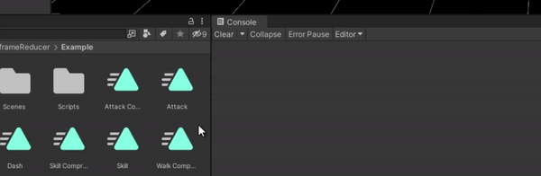
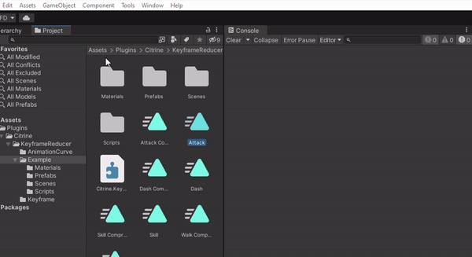
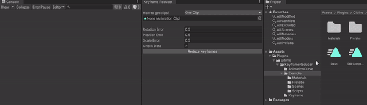
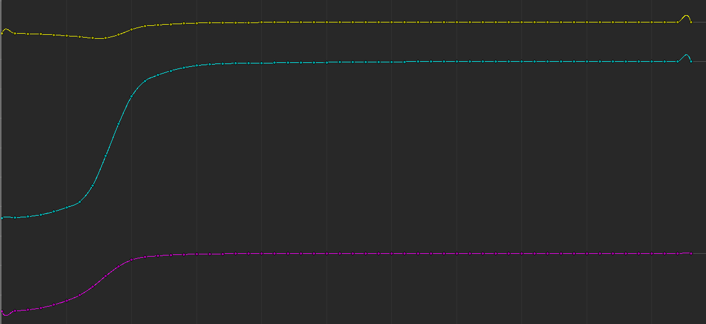
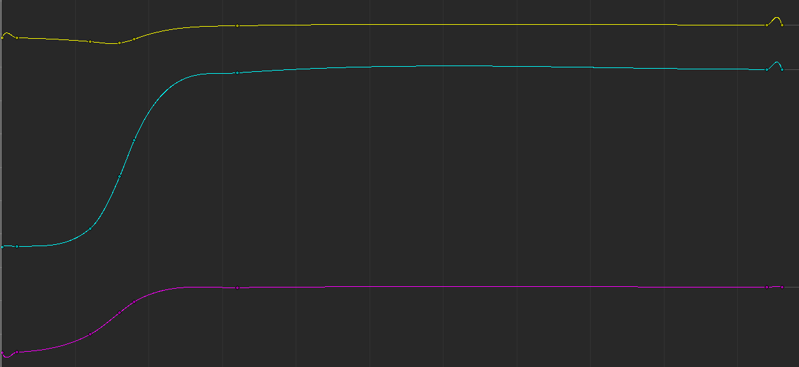

# Keyframe Reducer In Unity

## 安装 Installation

Make sure your Unity Version >= 2021.3

1. Open `Window` -> `Package Manager`
2. Click `+` -> `Add package from git URL...`
3. Enter `https://github.com/txtxj/Unity-Animation-Compression-Keyframe-Reducer.git?path=Assets/Plugins/Citrine/KeyframeReducer`

## 实现 Solution

Read the animation curve into several tracks, each track compressed independently.

将动画曲线读入多个轨道，每个轨道独立压缩。

First, all components of the same variable are combined and stored in the `IKeyframeBase` implementation.

首先，每个变量的所有分量被组合存储在 `IKeyframeBase` 的一个实现（轨道）中。

Then, for each curve, determine whether each keyframe can be interpolated by the two keyframes before and after it, and if so, this frame can be deleted.

然后，对于每个曲线的每个关键帧，如果该帧可以通过其前后两个关键帧插值得到，则删除该帧。

## 用法 Usage

The only interface is

唯一的接口如下

```csharp
KeyframeReducer reducer = new KeyframeReducer();
reducer.ReduceKeyframes(clip, rotationError, positionError, scaleError, checkData);
```

You can use the scripts under inside the Editor:

在编辑器下通过以下方法使用工具：

1. As Context Menu of file (`RMB` -> `Citrine` -> `Fast Keyframe Reduction`):

   右键快速压缩选中动画



2. As Menu Item for selected file (`Assets` -> `Citrine` -> `Fast Keyframe Reduction`):

   工具栏中快速压缩选中动画



3. As Window (`Tools` -> `Citrine` -> `Keyframe Reducer`)

   打开完整窗口



## 进阶 Advanced

You can easily derive curve classes of other data types and compress them by implement `IKeyframeBase<T>` and `AnimationCurveBase<T>`, and then add an error function to KeyframeReducer.

通过派生 `IKeyframeBase<T>` 和 `AnimationCurveBase<T>`，并添加一个误差函数，即可压缩其他数据类型的曲线。

## 效果 Result

### 单一曲线 Single Curve:

<table><tr>
  <td>
    
    <p style="display: block; text-align: center; color: #969696;padding: 10px;">Origin</p>
  </td>
		<td>
    
    <p style="display: block; text-align: center; color: #969696;padding: 10px;">Reduced</p>
  </td>
</tr></table>

### 模型 Model Animation:

Model source: https://github.com/fish-ken/unity-animation-compressor

|   | before | after |
|:-:|:------:|:-----:|
| Attack | 176.3 | 168.1 |
| Dash | 97.7 | 87.9 |
| Skill | 446.3 | 415.0 |
| Walk | 78.1 | 74.8 |

Error Rate: 0.5%

## 参考 Reference

- https://www.bzetu.com/344/.html
- https://en.wikipedia.org/wiki/Cubic_Hermite_spline
- https://zhuanlan.zhihu.com/p/328712220
- https://blog.csdn.net/seizeF/article/details/96368503
- https://github.com/needle-mirror/com.unity.live-capture
- https://github.com/fish-ken/unity-animation-compressor